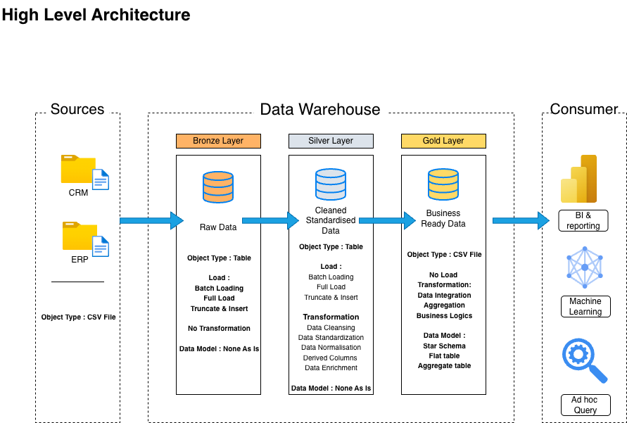
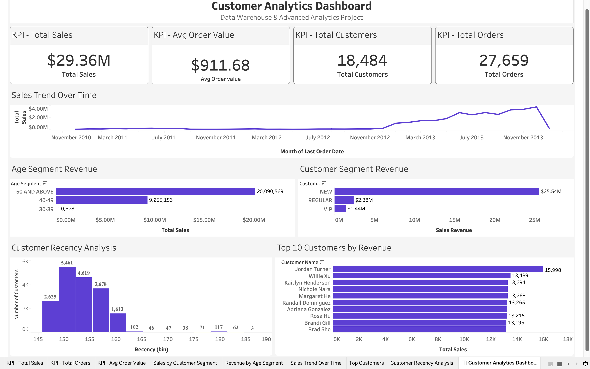
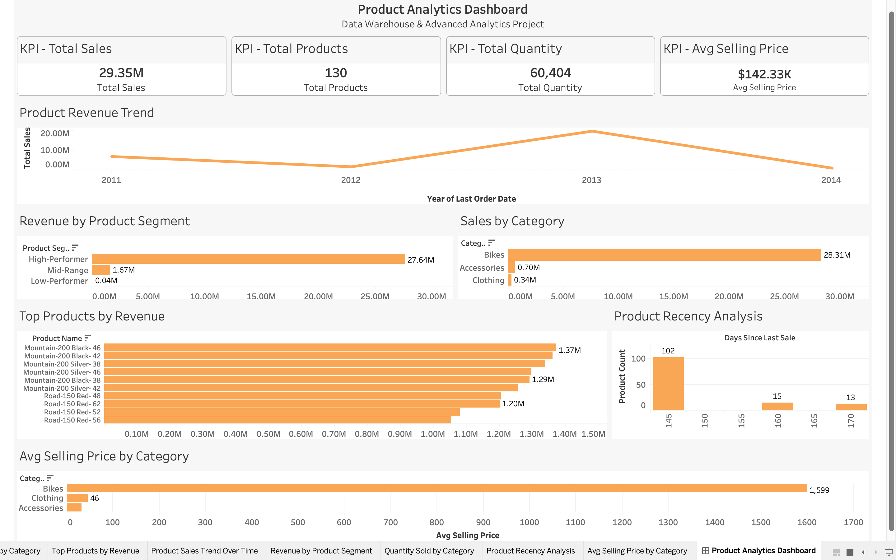

# Data Warehouse and Analytics Project

Welcome to the **Data Warehouse and Analytics Project** repository! 🚀  
This project demonstrates a comprehensive data warehousing and analytics solution, from building a data warehouse to generating actionable insights. Designed as a portfolio project, it highlights industry best practices in data engineering and analytics.

---
## 🏗️ Data Architecture

The data architecture for this project follows Medallion Architecture **Bronze**, **Silver**, and **Gold** layers:


1. **Bronze Layer**: Stores raw data as-is from the source systems. Data is ingested from CSV Files into SQL Server Database.
2. **Silver Layer**: This layer includes data cleansing, standardization, and normalization processes to prepare data for analysis.
3. **Gold Layer**: Houses business-ready data modeled into a star schema required for reporting and analytics.

---
## 📖 Project Overview

This project involves:

1. **Data Architecture**: Designing a Modern Data Warehouse Using Medallion Architecture **Bronze**, **Silver**, and **Gold** layers.
2. **ETL Pipelines**: Extracting, transforming, and loading data from source systems into the warehouse.
3. **Data Modeling**: Developing fact and dimension tables optimized for analytical queries.
4. **Analytics & Reporting**: Creating SQL-based reports and dashboards for actionable insights.

🎯 This repository is an excellent resource for professionals and students looking to showcase expertise in:
- SQL Development
- Data Architect
- Data Engineering  
- ETL Pipeline Developer  
- Data Modeling  
- Data Analytics  

---

## 🛠️ Important Links & Tools:

Everything is for Free!
- **[Datasets](datasets/):** Access to the project dataset (csv files).
- **[PostgreSQL]([https://www.microsoft.com/en-us/sql-server/sql-server-downloads](https://www.postgresql.org/download/)):** Lightweight server for hosting your SQL database.
- **[pgadmin)]([https://learn.microsoft.com/en-us/sql/ssms/download-sql-server-management-studio-ssms?view=sql-server-ver16](https://www.pgadmin.org)):** GUI for managing and interacting with databases.
- **[Git Repository](https://github.com/):** Set up a GitHub account and repository to manage, version, and collaborate on your code efficiently.
- **[DrawIO](https://www.drawio.com/):** Design data architecture, models, flows, and diagrams.
- **[Notion Project Steps](https://www.notion.so/Data-Warehouse-Project-36ca96a50405809cbfdadea319e70531?source=copy_link):** Access to All Project Phases and Tasks.

---

## 🚀 Project Requirements

### Building the Data Warehouse (Data Engineering)

#### Objective
Develop a modern data warehouse using SQL Server to consolidate sales data, enabling analytical reporting and informed decision-making.

#### Specifications
- **Data Sources**: Import data from two source systems (ERP and CRM) provided as CSV files.
- **Data Quality**: Cleanse and resolve data quality issues prior to analysis.
- **Integration**: Combine both sources into a single, user-friendly data model designed for analytical queries.
- **Scope**: Focus on the latest dataset only; historization of data is not required.
- **Documentation**: Provide clear documentation of the data model to support both business stakeholders and analytics teams.

---

### BI: Analytics & Reporting (Data Analysis)

#### Objective
Develop SQL-based analytics to deliver detailed insights into:
- **Customer Behavior**
- **Product Performance**
- **Sales Trends**

These insights empower stakeholders with key business metrics, enabling strategic decision-making.  

For more details, refer to [docs/requirements.md](docs/requirements.md).

## 📂 Repository Structure
```
data-warehouse-project/
│
├── datasets/                           # Raw datasets used for the project (ERP and CRM data)
│
├── docs/                               # Project documentation and architecture details
│   ├── etl.drawio                      # Draw.io file shows all different techniquies and methods of ETL
│   ├── data_architecture.drawio        # Draw.io file shows the project's architecture
│   ├── data_catalog.md                 # Catalog of datasets, including field descriptions and metadata
│   ├── data_flow.drawio                # Draw.io file for the data flow diagram
│   ├── data_models.drawio              # Draw.io file for data models (star schema)
│   ├── naming-conventions.md           # Consistent naming guidelines for tables, columns, and files
│
├── scripts/                            # SQL scripts for ETL and transformations
│   ├── bronze/                         # Scripts for extracting and loading raw data
│   ├── silver/                         # Scripts for cleaning and transforming data
│   ├── gold/                           # Scripts for creating analytical models
│
├── tests/                              # Test scripts and quality files
│
├── README.md                           # Project overview and instructions
├── LICENSE                             # License information for the repository
├── .gitignore                          # Files and directories to be ignored by Git
└── requirements.txt                    # Dependencies and requirements for the project
```
---


# 📊 Analytics Dashboards
## 👥 Customer Analytics Dashboard

The Customer Analytics Dashboard focuses on:

Customer behavior analysis
Customer segmentation
Revenue contribution
Customer recency
Sales trends
Top customer identification
🔹 KPIs Included
Total Sales
Total Customers
Total Orders
Average Order Value
🔹 Business Insights
Identified high-value customer groups
Analyzed customer purchasing trends
Measured customer engagement through recency analysis
Evaluated revenue contribution by age and customer segment

--- 

📸 Dashboard Preview


---

📄 Documentation
Customer Analytics Dashboard Summary
KPI explanations
Business questions & insights
Chart interpretation
[Customer Analytics Dashboard Documentation](docs/Customer_Analytics_Dashboard_Summary.pdf)

---

## 📦 Product Analytics Dashboard

The Product Analytics Dashboard focuses on:

Product performance analysis
Product revenue trends
Product category analysis
Product recency
Product segmentation
Pricing analytics
🔹 KPIs Included
Total Sales
Total Products
Total Quantity Sold
Average Selling Price
🔹 Business Insights
Bikes category generated the highest revenue
High-performing products dominated overall sales
Premium products contributed most business revenue
Most products remained actively sold based on recency analysis

---

📸 Dashboard Preview


---

📄 Documentation
Product Analytics Dashboard Summary
Detailed KPI explanations
Business insights
Chart-level analysis
[Product Analytics Dashboard Documentation](docs/Product_Analytics_Dashboard_Summary.pdf)

---

🛠️ Tech Stack
- Category	Technologies
- Database	PostgreSQL
- Query Language	SQL
- BI Tool	Tableau
- Version Control	Git & GitHub
- Architecture Design	Draw.io
- Documentation	Markdown
- Data Source	CSV Files

--- 

🛠️ Important Links & Tools

Everything used in this project is completely free.

- Datasets → Access ERP & CRM datasets
- PostgreSQL → Database system
- pgAdmin → Database GUI tool
- GitHub → Version control & collaboration
- DrawIO → Architecture & data modeling diagrams
- Notion Project Workflow → Step-by-step project phases
- 🚀 Project Requirements
- Building the Data Warehouse

---

- # Objective

Develop a modern analytical data warehouse capable of consolidating sales data from ERP and CRM systems for reporting and analytics.

- Specifications
- Import CSV datasets into PostgreSQL
- Clean and standardize raw datasets
- Build analytical data models
- Create business-ready reporting tables
- Optimize for analytical queries
- 📈 BI Analytics & Reporting

---

- # Objective

Generate actionable business insights through SQL analytics and Tableau dashboards.

- Analytics Areas
- Customer Behavior
- Product Performance
- Sales Trends
- Revenue Analysis
- Recency Analysis
- Customer Segmentation
- Product Segmentation
